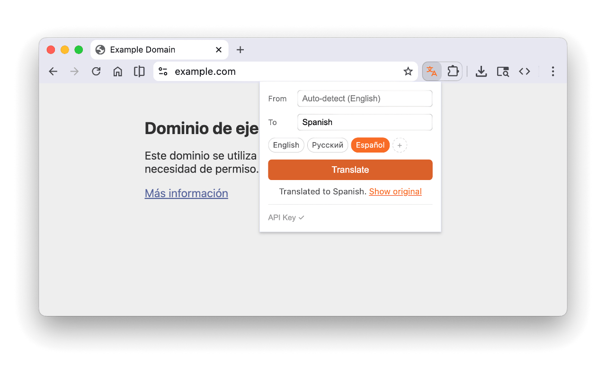

# Yaku — Page Translator

Chrome extension that translates web pages using Google Cloud Translation API. Bring your own API key.

**Homepage:** [yaku.vlad.studio](https://yaku.vlad.studio)

## Features

- Translate any web page with one click
- Auto-detects source language
- 110+ languages supported
- Save up to 4 favorite languages
- Translates dynamically loaded content
- Cancel and restore original text anytime
- Progress indicator in toolbar icon

## Setup

1. Install from Chrome Web Store (or load unpacked from this repo)
2. Get a [Google Cloud API key](https://console.cloud.google.com/apis/credentials)
3. Enable the [Cloud Translation API](https://console.developers.google.com/apis/api/translate.googleapis.com/overview)
4. Click the Yaku icon, open **API Key** settings, paste your key

## How it works

Yaku sends page text to Google Cloud Translation API v2 using your own API key. Translation happens in batches for efficiency. All API calls are routed through the extension's service worker to handle CORS.

## Privacy

- Your API key is stored locally in Chrome storage
- Page text is sent only to Google Cloud Translation API
- No data is collected or sent anywhere else

## License

[MIT](LICENSE)
